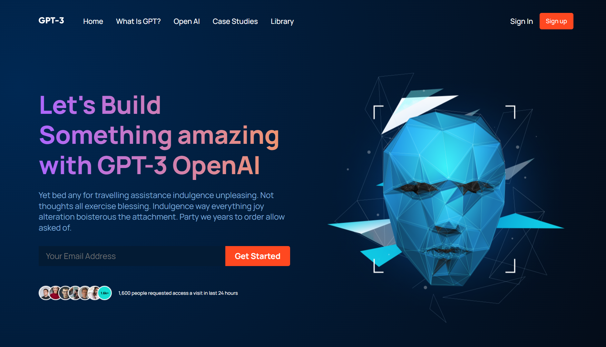

# GPT3 fully responsive website using React 

### The Challenge

Users should be able to:

- View the optimal layout for the component depending on their device's screen size
- See hover states for all interactive elements on the page

### Screenshot

### Links

- [Live Site URL](https://mdajmalshadab.github.io/Front-End-Projects/5-Faq-Accordion-Card-Main/index.html#default)

## My Process

### Built with

- HTML5
- CSS
- Flexbox
- React JS

### What I learned

- React Functional components and their reusability
- React file and folder structure
- Fundamental CSS properties to master flex
- Complex gradient design 
- Perfectly placed media queries for satisfactory responsiveness covering almost devices
